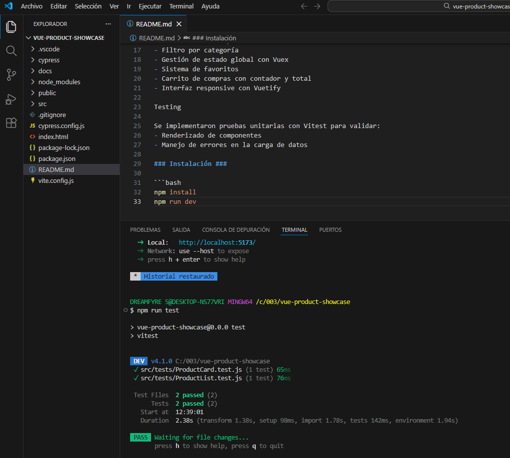

Vue Product Showcase

Aplicación SPA desarrollada con Vue 3 que permite visualizar un catálogo de productos, filtrarlos por categoría y gestionar favoritos y carrito de compras.

Tecnologías utilizadas

- Vue 3
- Vuex
- Vuetify
- Axios
- Vitest (testing)

Funcionalidades

- Consumo de API externa (Fake Store API)
- Visualización de productos dinámicos
- Filtro por categoría
- Gestión de estado global con Vuex
- Sistema de favoritos
- Carrito de compras con contador y total
- Interfaz responsive con Vuetify

Testing

Se implementaron dos pruebas unitarias: una para validar el renderizado correcto del componente ProductCard, comprobando que muestra la información del producto, y otra para verificar la respuesta visual ante un error en la carga de datos en ProductList.

Evidencia de pruebas

Se ejecutaron pruebas unitarias con Vitest, obteniendo resultados exitosos:

### Instalación ###

1-Clonar el repositorio:

git clone https://github.com/codeLiseth/vue-product-showcase

2-Entrar a la carpeta del proyecto:

cd vue-product-showcase

3-Instalar dependencias:

npm install

4-Ejecutar la aplicación:

npm run dev

5-Ejecutar pruebas:

npm run test